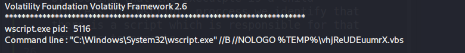

 #Discription:

One of the SOC analysts took a memory dump from a machine infected with a meterpreter malware. your job is to analyze the dump, extract the available indicators of compromise (IOCs).

 #start point :

At start we need to know the profile of the image we are dealing with we can simply extract this information using the "imageinfo" plugin 

by looking around the proccess that are running we will notice a suspicious proccess called "UWkpjFjDzM.exe" and using the "pstree" plugin we identify that it's a child proccess of "wscript.exe"

using "netscan" plugin we figured that our machine has the ip "10.0.0.101" and knowing about the suspicious proccess we can extract the ip of the attacker using the same plugin which is "10.0.0.106"

now we can dump the proccess for analyzing it using reverse engineering after we complete our memory investigating

using the plugin "procdump".

We can continue our analysis by seeing how that file executed.

by looking that the executple is a child proccess of "wscript" proccess we identify that there is a script which is responsible for that proccess to execute 

we can see what is the parameter that invoked with "wscript" proccess which is the script we are looking for.

by using "cmdline" plugin against the "wscript" pid we see that the script name is "vhjReUDEuumrX.vbs"

